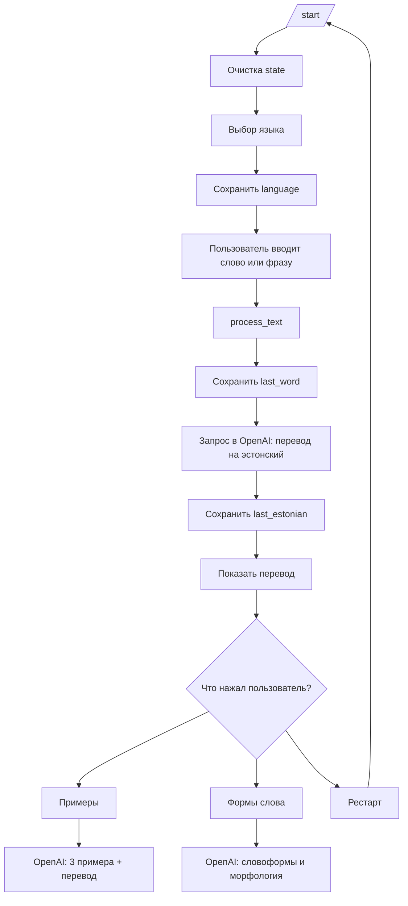

# TG Estonian Bot

Бот для перевода слов и фраз с русского или английского на эстонский. После перевода он может показать примеры употребления и формы слова.

## Что есть внутри

- `bot.py` - точка входа и запуск polling
- `handlers.py` - все хендлеры Telegram
- `services.py` - вызов OpenAI и HTML-экранирование
- `prompts.py` - генерация промптов
- `keyboards.py` - inline-клавиатуры
- `state.py` - FSM-состояния
- `config.py` - загрузка `.env` и настройка логирования
- `.env` - токены Telegram и OpenAI
- `.env.example` - шаблон переменных окружения
- `requirements.txt` - зависимости
- `README.md` - описание логики и схемы работы

## Как работает бот

### 1. Запуск
- Загружаются переменные окружения через `load_dotenv()`.
- Из `.env` берутся `TELEGRAM_TOKEN` и `OPENAI_API_KEY`.
- `bot.py` создает `Bot`, `Dispatcher` и подключает router из `handlers.py`.
- `services.py` создает клиент `OpenAI`.

### 2. Команда `/start`
- Бот очищает состояние FSM.
- Показывает выбор языка: русский или английский.
- После этого переводит пользователя в состояние `choosing_language`.

### 3. Выбор языка
- При нажатии на кнопку языка бот сохраняет `language=ru` или `language=en`.
- Пользователь получает подсказку: можно вводить слово или фразу.

### 4. Ввод текста
- Любое текстовое сообщение ловит общий обработчик `process_text()`.
- Если язык еще не выбран, бот просит сначала нажать `/start`.
- Если язык уже есть, бот:
  - сохраняет исходный текст как `last_word`;
  - отправляет запрос в OpenAI для перевода на эстонский;
  - сохраняет результат как `last_estonian`.
- Если пользователь отправляет не текст, бот просит прислать текстовое сообщение.

### 5. Ответ после перевода
- Бот отправляет перевод пользователю.
- Показывает inline-меню:
  - `Примеры`
  - `Формы слова` только если введено одно слово
  - `Рестарт`
- Все пользовательские ответы приведены к HTML-формату.
- Меню собирается в `keyboards.py`, а показ меню вынесен в helper `send_menu()`.

### 6. Кнопка `Примеры`
- Бот берет `last_estonian`.
- Просит OpenAI сгенерировать 3 естественных предложения на эстонском.
- После каждого предложения добавляется перевод на язык интерфейса.

### 7. Кнопка `Формы слова`
- Бот берет `last_estonian`.
- Если исходный ввод был одним словом, OpenAI просит дать словоформы и краткую морфологию.
- Если пользователь вводил фразу, бот сообщает, что формы доступны только для одного слова.

### 8. Кнопка `Рестарт`
- Бот возвращает пользователя к сцене `/start` и выбору языка.

## Что было улучшено

- Промпты вынесены в отдельные функции:
  - `make_translation_prompt()`
  - `make_examples_prompt()`
  - `make_forms_prompt()`
- Код разнесен по отдельным модулям, чтобы `bot.py` остался только точкой входа.
- Все ответы отправляются в едином HTML-формате.
- Пользовательский текст экранируется перед выводом, чтобы не ломать разметку.
- Добавлено логирование через `logging`.
- Запрос к OpenAI выполняется через `asyncio.to_thread()`, чтобы не блокировать бота.
- Добавлена защита от пустых и не-текстовых сообщений.
- Добавлен `.env.example` для быстрого старта проекта.

## Состояния FSM

В `LearnFlow` хранятся:

- `choosing_language` - этап выбора языка
- `language` - выбранный язык интерфейса
- `last_word` - последний введенный текст
- `last_estonian` - последний полученный перевод

## Схема работы

## Как лучше понимать логику

- Бот не ведет длинный чат, а работает от последнего введенного текста.
- Все дополнительные действия завязаны на сохраненные значения `last_word` и `last_estonian`.
- Кнопка `Формы слова` имеет смысл только после ввода одного слова.
- Кнопка `Примеры` использует уже переведенное эстонское слово.

## Что можно улучшить еще

- Разнести кнопки меню и текстовые ответы по отдельным helper-функциям.
- Добавить более строгую валидацию ответа OpenAI перед отправкой.
- Перейти на полностью асинхронный OpenAI-клиент, если это потребуется для нагрузки.

## Запуск

1. Установить зависимости из `requirements.txt`.
2. Создать `.env` по образцу из `.env.example`.
3. Указать ключи:
   - `TELEGRAM_TOKEN`
   - `OPENAI_API_KEY`
4. Запустить `bot.py`.
